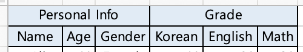

# 1-1. Export
## Server
### 1) DTO 클래스 생성하기

* DTO 클래스에서 아래 어노테이션들을 사용하여 Header 영역의 컬럼 구성과 각 컬럼의 이름과 스타일을 정의할 수 있습니다.

🔻 `@ExcelColumn`
* 엑셀의 컬럼으로 들어갈 필드 위에는 `@ExcelColumn` 어노테이션을 붙여줍니다.
* `@ExcelColumn`을 통해 헤더의 이름, 컬럼의 위치, 헤더 스타일, 바디 스타일, 드롭다운을 정의할 수 있습니다.
* 컬럼은 DTO에 필드가 기재된 순서대로 생성됩니다.
    ```java
    
    @Target(ElementType.FIELD)
    @Retention(RetentionPolicy.RUNTIME)
    public @interface ExcelColumn {
        String headerName() default "";
        int columnIndex() default 0; // This field is only used for importing Excel
        ExcelColumnStyle headerStyle() default @ExcelColumnStyle(excelCellStyleClass = NoExcelCellStyle.class);
        ExcelColumnStyle bodyStyle() default @ExcelColumnStyle(excelCellStyleClass = NoExcelCellStyle.class);
        String[] dropdown() default {};
    }
    ```
---
🔻 `@ExcelColumnStyle`
* 엑셀 스타일을 정의할 때는 `@ExcelColumnStyle` 어노테이션을 사용합니다.
* `excelCellStyleClass`에는 `ExcelCellStyle`을 구현한 클래스를 넣어주고, 클래스 내에 enum으로 정의된 스타일이 있는 경우 `enumName`에 enum 명을 담아주면 됩니다.
* 특정 컬럼에만 해당 스타일을 적용하고 싶은 경우 `@ExcelColumn`의 `headerStyle`, `bodyStyle` 필드에 값을 넣어주면 됩니다.
* `@ExcelColumn`에 정의된 스타일이 없는 경우, `@DefaultHeaderStyle`과 `@DefaultBodyStyle`에 정의된 스타일이 적용됩니다.
* 스타일을 별도로 정의하지 않는 경우, 기본적으로 `NoExcelCellStyle`(글자색 검정, 셀 채우기 없음, 셀 테두리 없음)이 적용됩니다.
* 자세한 내용은 [스타일 클래스 생성 방법 안내 문서](./STYLE.md)에서 확인하실 수 있습니다.
  
  ```java
  public @interface ExcelColumnStyle {
      Class<? extends ExcelCellStyle> excelCellStyleClass();
      String enumName() default "";
  }
  ```
  ```java
  @Target(ElementType.TYPE)
  @Retention(RetentionPolicy.RUNTIME)
  public @interface DefaultHeaderStyle {
      ExcelColumnStyle style();
  }
  ```
  ```java
  @Target(ElementType.TYPE)
  @Retention(RetentionPolicy.RUNTIME)
  public @interface DefaultBodyStyle {
      ExcelColumnStyle style();
  }
  ```
---

🔻 DTO 예시    


* 위와 같은 헤더를 생성하고자 할 때에는 아래와 같이 DTO를 생성하면 됩니다.

  ```java
  @Getter
  public class PersonalInfo {
      //
      @ExcelColumn(headerName = "Name")
      private String name;
      @ExcelColumn(headerName = "Age")
      private int age;
      @ExcelColumn(headerName = "Gender", dropdown = {"Male", "Female"})
      private String gender;
  }
  ```
  ```java
  @Getter
  @Setter
  @NoArgsConstructor
  @AllArgsConstructor
  public class Grade {
    @ExcelColumn(headerName = "Korean")
    private int korean;
    @ExcelColumn(headerName = "English")
    private int english;
    @ExcelColumn(headerName = "Math")
    private int math;
  }
  ```
  ```java
  @Getter
  @DefaultHeaderStyle(style = @ExcelColumnStyle(excelCellStyleClass = DefaultExcelCellStyle.class, enumName = "BLUE_HEADER"))
  @DefaultBodyStyle(style = @ExcelColumnStyle(excelCellStyleClass = DefaultExcelCellStyle.class, enumName = "BODY"))
  public class ExcelSampleDto {
      @ExcelColumn(headerName = "Personal Info")
      private PersonalInfo personalInfo;
      @ExcelColumn(headerName = "Grade")
      private Grade grade;
  }
  ```
---

### 2) API 생성하기
* `ExcelFile` 객체를 생성한 다음 `HttpServletResponse`의 OutputStream에 작성하여 클라이언트에 전송합니다.
  ```java
  @RestController
  public class Controller {
  
      @PostMapping(value = "/export-excel-via-dto")
      public void exportExcel(HttpServletResponse response, @RequestBody List<ExcelSampleDto> data) throws IOException {
        response.setContentType("application/vnd.ms-excel");
        ExcelFile excelFile = new OneSheetExcelFile<>(data, ExcelSampleDto.class);
        excelFile.write(response.getOutputStream());
      }
  
  }
  ```

## Frontend
* Axios 라이브러리를 사용해서 서버로부터 엑셀 파일을 다운 받을 수 있습니다.
  ```typescript
  axios.post(
      '/export-excel-via-dto',
      data,
      {
          responseType: 'blob',
          headers: {'Content-Type': 'application/json'}
      }
  )
      .then((response) => {
          const blob = new Blob([response.data], {type: 'application/vnd.ms-excel'});
          const url = window.URL.createObjectURL(blob);
          const a = document.createElement('a');
          a.href = url;
          a.download = 'export.xlsx';
          a.click();
      });
  ```
